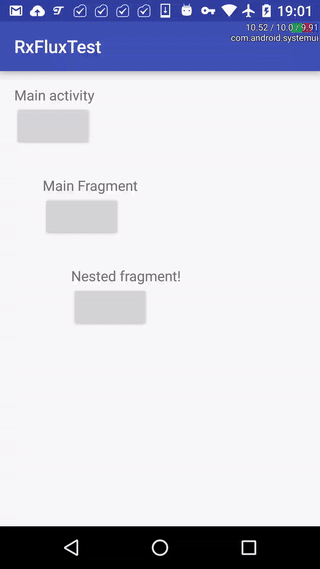

# Little [RxPaparazzo](https://github.com/FuckBoilerplate/RxPaparazzo) fix request :-)

In nested fragments, if user was asked about permission of grabbing images from gallery and declined it - RxPaparazzo will call subscribers. In any other case there's no reaction. 

